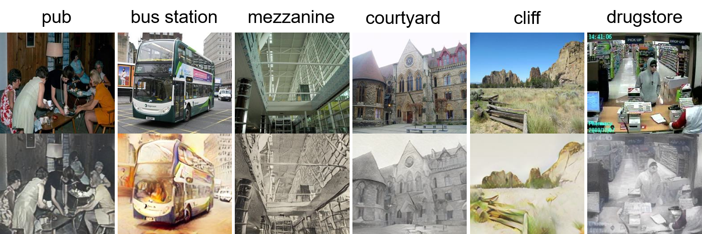

# Scene Classification on fine-arts with Style Transfer

## Introduction
Our approach utilizes two Vision Transformer (ViT) models, SWAG and Hiera, which are pre-trained on the Places365 dataset and subsequently tested on actual artworks. Due the discrepancy between photographic images and fine arts, we employ artistic style transfer techniques to adapt photographs to resemble artistic styles. The fine arts dataset used in our study is annotated according to Places365 categories and serves as the basis for fine-tuning and testing our models.

## Requirements
Following libraries are required:
- hiera-transformer 0.1.4
- huggingface-hub 0.21.4
- python 3.8
- PyTorch 1.8.0
- CUDA 11.8

## Results
To eliminate the gap between real artworks and photographic images, we applied artistic style transfer technique first.
The results of the style transfer are shown below:

The results of the scene classification after fine-tuning are shown below:

